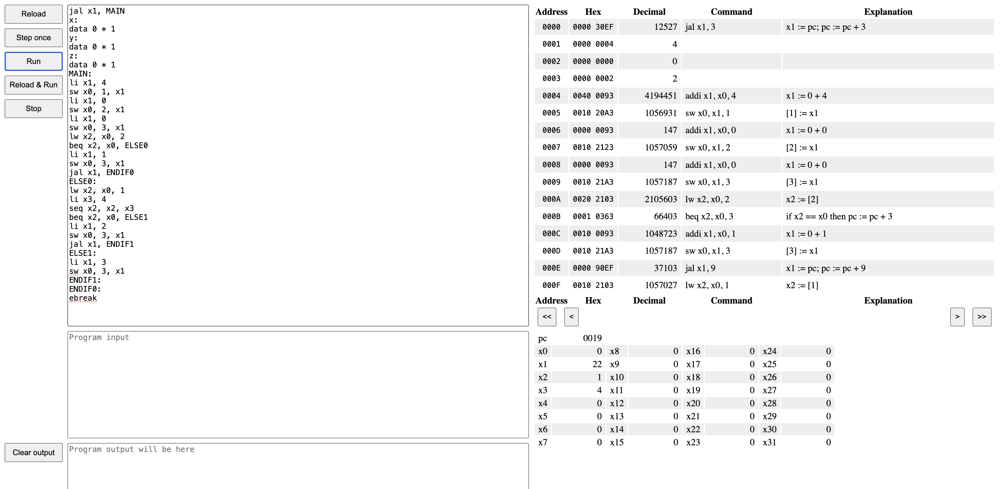
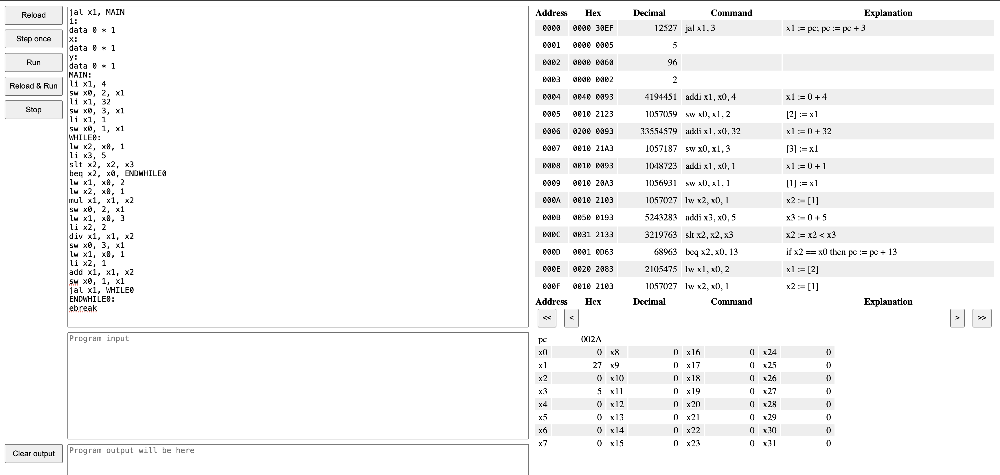
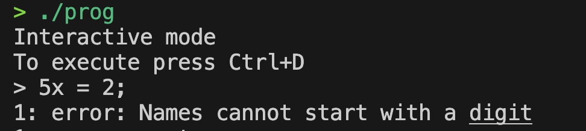
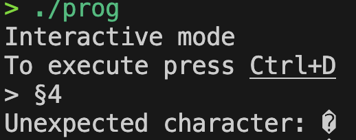

# Examples

In this section you can see examples of how the programme works.

## Correct programmes
### Assignment

**Query:**

```C
x = 4; y = 5;
```

**Output:**

`out.S`

```
    jal x1, MAIN
    x:
    data 0 * 1
    y:
    data 0 * 1
    MAIN:
    li x1, 4
    sw x0, 1, x1
    li x1, 5
    sw x0, 2, x1
    ebreak
```
{collapsible="true" collapsed-title="asm"}
### Arithmetic and logical operations. Branching, including optional elif. Support for integer and logical data types. C-like multi-line comments.

**Query:**

```C
x = 4; 
y = false;
z = 0;
if (y) {
    z = 1;
}
/* Some Comment 
 Multi-line 
 Should be ignored 
*/
elif (x == 4) {
    z = 2;
}
else {
    z = 3;
}
```

**Output:**

`out.S`

```
jal x1, MAIN
x:
data 0 * 1
y:
data 0 * 1
z:
data 0 * 1
MAIN:
li x1, 4
sw x0, 1, x1
li x1, 0
sw x0, 2, x1
li x1, 0
sw x0, 3, x1
lw x2, x0, 2
beq x2, x0, ELSE0
li x1, 1
sw x0, 3, x1
jal x1, ENDIF0
ELSE0:
lw x2, x0, 1
li x3, 4
seq x2, x2, x3
beq x2, x0, ELSE1
li x1, 2
sw x0, 3, x1
jal x1, ENDIF1
ELSE1:
li x1, 3
sw x0, 3, x1
ENDIF1:
ENDIF0:
ebreak
```
{collapsible="true" collapsed-title="asm"}

`tree`
```
List
Assignment x
    Constant 4
List
    Assignment y
    Constant 0
    List
    Assignment z
        Constant 0
    If
        Symbol y
        Assignment z
        Constant 1
        If
        Comparison ==
            Symbol x
            Constant 4
        Assignment z
            Constant 2
        Assignment z
            Constant 3  
```
{collapsible="true" collapsed-title="tree"}



### For operator

**Query:**

```C
x = 4;
y = 32;
for (i = 1; i < 5; i = i + 1) {
    x = x * i;
    y = y / 2;
}
```

**Output:**

`out.S`

```
jal x1, MAIN
i:
data 0 * 1
x:
data 0 * 1
y:
data 0 * 1
MAIN:
li x1, 4
sw x0, 2, x1
li x1, 32
sw x0, 3, x1
li x1, 1
sw x0, 1, x1
WHILE0:
lw x2, x0, 1
li x3, 5
slt x2, x2, x3
beq x2, x0, ENDWHILE0
lw x1, x0, 2
lw x2, x0, 1
mul x1, x1, x2
sw x0, 2, x1
lw x1, x0, 3
li x2, 2
div x1, x1, x2
sw x0, 3, x1
lw x1, x0, 1
li x2, 1
add x1, x1, x2
sw x0, 1, x1
jal x1, WHILE0
ENDWHILE0:
ebreak
```
{collapsible="true" collapsed-title="asm"}

`tree`
```
List
Assignment x
    Constant 4
List
    Assignment y
    Constant 32
    For
    Assignment i
        Constant 1
    Comparison <
        Symbol i
        Constant 5
    Assignment i
        Operator +
        Symbol i
        Constant 1
    List
        Assignment x
        Operator *
            Symbol x
            Symbol i
        Assignment y
        Operator /
            Symbol y
            Constant 2
```
{collapsible="true" collapsed-title="tree"}




### While operator

**Query:**

```C
x = 2;
while(x <= 10) {
    if (x == 4) {
        x = x + 2;
    }
    else {
        x = x + 1;
    }
}
```

**Output:**

`out.S`

```
jal x1, MAIN
x:
data 0 * 1
MAIN:
li x1, 2
sw x0, 1, x1
WHILE0:
lw x2, x0, 1
li x3, 10
seq x4, x2, x3
slt x5, x2, x3
or x2, x4, x5
beq x2, x0, ENDWHILE0
lw x2, x0, 1
li x3, 4
seq x2, x2, x3
beq x2, x0, ELSE0
lw x1, x0, 1
li x2, 2
add x1, x1, x2
sw x0, 1, x1
jal x1, ENDIF0
ELSE0:
lw x1, x0, 1
li x2, 1
add x1, x1, x2
sw x0, 1, x1
ENDIF0:
jal x1, WHILE0
ENDWHILE0:
ebreak
```
{collapsible="true" collapsed-title="asm"}

`tree`
```
List
  Assignment x
    Constant 2
  While
    Comparison <=
      Symbol x
      Constant 10
    If
      Comparison ==
        Symbol x
        Constant 4
      Assignment x
        Operator +
          Symbol x
          Constant 2
      Assignment x
        Operator +
          Symbol x
          Constant 1
```
{collapsible="true" collapsed-title="tree"}


## Error handling




