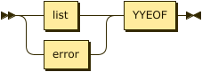
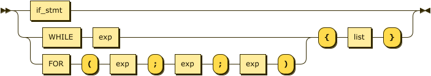
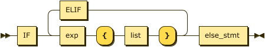
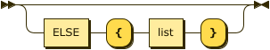
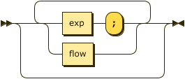
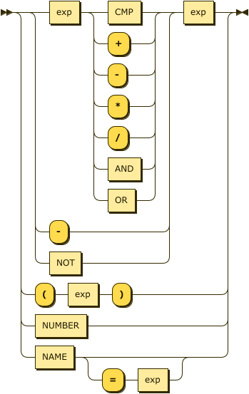

## Получившаяся грамматика
**prog:**

**flow:**

referenced by:

* list

**if_stmt:**

referenced by:

* flow

**else_stmt:**

referenced by:

* if_stmt

**list:**

referenced by:

* else_stmt
* flow
* if_stmt
* prog

**exp:**

referenced by:

* exp
* flow
* if_stmt
* list

